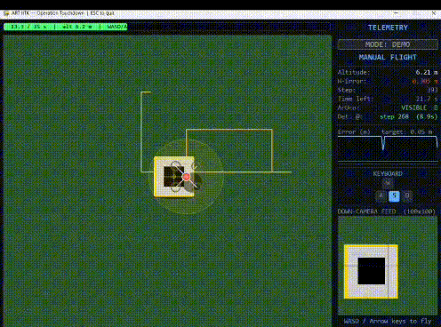

# Level 2 — Operation Touchdown: Precision Landing

> **Team Aerial Robotics IITK | Y25 Recruitment Hackathon**
>
---

## 1. Context

A drone is descending. You cannot stop it. The landing platform is oscillating sinusoidally below you — it never stops moving. Your only sensor is a downward-facing camera. You must steer the drone laterally so it touches down on the platform centre. No GPS. No position sensor. Everything inferred from pixels.

---

## 2. Environment

### Simulation

| Parameter | Value |
|-----------|-------|
| Sim Duration | `35 seconds` — fixed descent, cannot be paused |
| Frame Rate | `30 FPS` (dt = 0.033 s) |
| Success Radius | Final error ≤ `0.05 m` from platform centre |
| Drone Start | `(80 px, 180 px)` — top-left, far from platform |
| Altitude | `10.0 m → 0.0 m`, auto-descending (uncontrollable) |
| Max Speed | `5.0 m/s` lateral (simulator enforced) |

### Landing Platform

| Parameter | Value |
|-----------|-------|
| Size | `1 m × 1 m` |
| X Motion | `centre_x + 2.0 × sin(0.9 t) m` — SHM, ±2 m amplitude |
| Y Motion | `centre_y + 0.6 × sin(0.45 t) m` — slow sinusoidal drift |

---

## 3. Camera

Each frame `step_env()` returns a flat list of **10 000 grayscale integers** (100 × 100 px, row-major).

**Field of view:** `fov_m = 0.30 × altitude` metres. Use this to convert pixel offsets to real-world metres.

| Region | Gray Value | Notes |
|--------|-----------|-------|
| Grass / background | ~45–90 | Dark green |
| Platform surface | ~200–230 | Bright rectangle — the landing pad |
| Inner ArUco square | ~0–20 | Near-black square at platform centre |

---

## 4. Your Task

Edit **`solver.py`** only. Implement the six TODOs:

| TODO | Where | What |
|------|-------|------|
| 1 | `SEARCH_SPEED` | Drone speed (m/s) during search. |
| 2 | `KP/KI/KD` constants | PID gains for X and Y axes. |
| 3 | `detect_platform()` | Find platform in pixel array. Return `(found, cx_norm, cy_norm)`. |
| 4 | `PID.update()` | Implement P + I + D with anti-windup. Return clamped velocity. |
| 5 | `search_velocity()` | Design a search pattern to sweep the arena. |
| 6 | `main()` — PID block | Convert `cx_norm / cy_norm` → metres via `sim.fov_m`. Feed into PID. |

### Phase 1 — Search

The drone starts top-left; the platform is not visible. Implement `search_velocity()` to sweep the arena until the platform enters the camera FOV.

### Phase 2 — Track & Land

Once detected, use PID to keep the drone centred over the moving platform throughout descent.

```python
err_x_m = cx_norm * (sim.fov_m / 2)
err_y_m = cy_norm * (sim.fov_m / 2)
vx = pid_x.update(err_x_m, dt)
vy = pid_y.update(err_y_m, dt)
```

---

## 5. Scoring

| Outcome | Points |
|---------|--------|
| Final error ≤ `0.20 m` | 10 |
| Final error ≤ `0.10 m` | 20 |
| Final error ≤ `0.05 m` **(SUCCESS)** | 50 |
| Bonus: error ≤ `0.02 m` | +20 |

---

## 6. Rules

### Allowed
- Edit `solver.py` freely — add functions, tune constants, import libraries.
- Use any pip-installable package (NumPy, OpenCV, SciPy, etc.).

### Not Allowed
- Modify `simulator_level2.py`.
- Access `sim.plat_x`, `sim.plat_y`, or any internal simulator variable.
- Hardcode the platform position or trajectory.

### Deliverables

Submit **`solver.py`** only. Must run with the original unmodified `simulator_level2.py` in the same directory:

```bash
python solver.py
```
